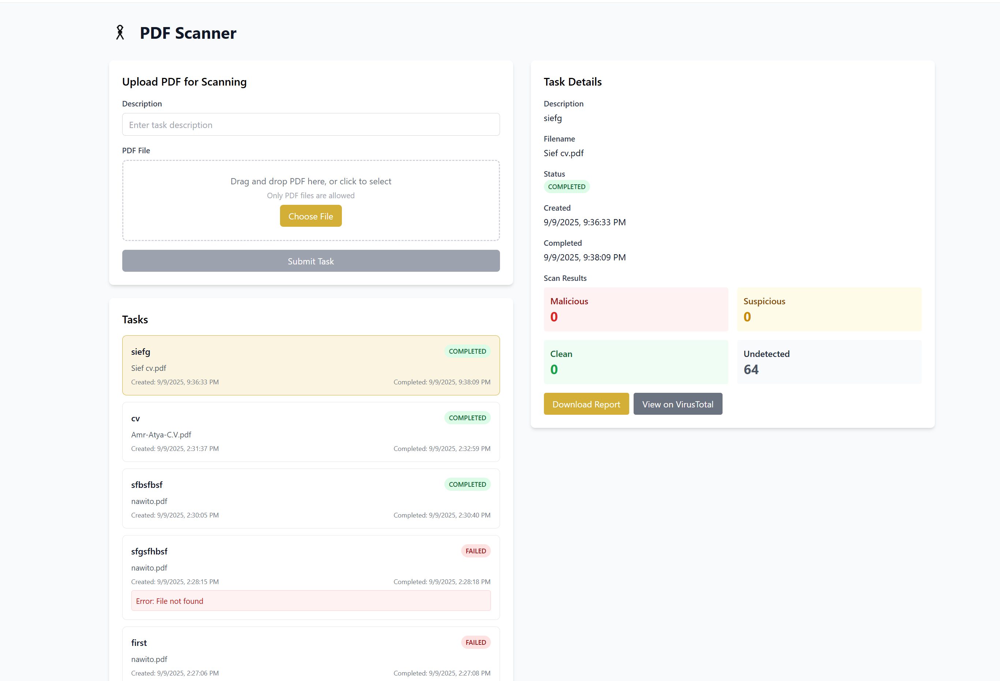

# PDF Scanner

Upload PDFs and scan them for viruses using VirusTotal API.

## Setup

1. Get a free VirusTotal API key from https://www.virustotal.com/
2. Copy `env.example` to `.env` and add your API key
3. Run: `docker-compose up --build`
4. Open http://localhost:3000

## How it works

1. Upload a PDF with a description
2. Worker processes it in the background
3. File gets scanned by VirusTotal
4. View results when complete

## Tech Stack

- **Backend**: FastAPI + PostgreSQL
- **Frontend**: React + TypeScript + Tailwind
- **Worker**: Background task processor
- **Deployment**: Docker Compose

## Local Development

```bash
# Backend
cd backend && pip install -r requirements.txt && python main.py

# Worker  
cd worker && pip install -r requirements.txt && python worker.py

# Frontend
cd frontend && npm install && npm start
```

## API

- `POST /api/tasks` - Upload PDF
- `GET /api/tasks` - List tasks
- `GET /api/tasks/{id}` - Task details
- `GET /api/reports/{id}` - Download report

## Testing

```bash
# Run all tests
py run_tests.py

# Run backend tests only
cd backend && py -m pytest test_api.py -v

# Run worker tests only
cd worker && py -m pytest test_worker.py -v
```

## Screenshot


